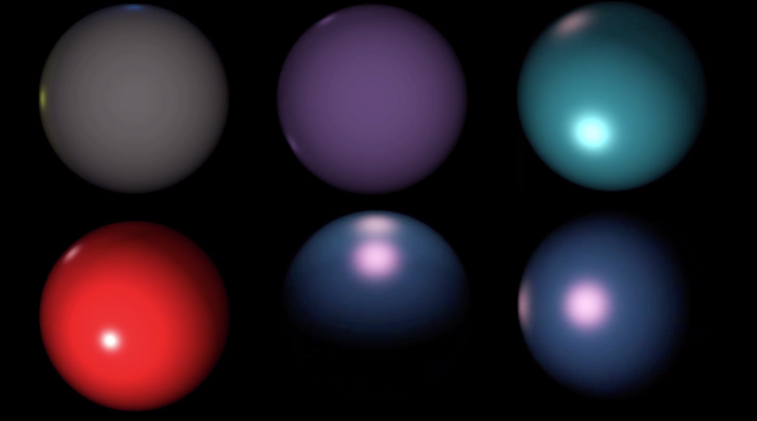

# DT1130-Project
Group project in the course DT1130 Spektral transforms. Made with Nils Ekenbäck 

Project description was as followed (in Swedish):

Inom 3D-grafik simuleras belysta ytor med en serie beräkningar, där hänsyn tas till ytans orientering i förhållande till ljuskällorna, ytans färg och materialegenskaper, liksom ljuskällornas färg
och intensitet.

Grunden ges av Lamberts cosinus-lag som säger att intensiteten av det ljus som reflekteras
från en matt yta (den diffusa reflektionen) är proportionell mot cosinus för ljusets infallsvinkel
(mätt i förållande till ytans normalvektor). Om man utnyttjar att skalärprodukten mellan två
vektorer av längden ett är lika med cosinus för vinkeln mellan dem så kan man skriva sambandet
som
```
ID = max{el·en, 0}
```
där ID är den intensiteten i en punkt p på ytan, el är en enhetsvektor från p mot ljuskällan
och en är ytans normalvektor i punkten. Denna faktor multipliceras sedan med ytans färg och
ljuskällans färg. För blanka ytor får man dessutom en belysningseffekt som är beroende av var
betraktarens position (blänket i en motorhuv ändras när man flyttar huvudet). Denna belysningsterm, som även kallas den spekulära reflektionen, är som störst när ljusets infallsvinkel och
betraktningsvinkeln är lika stora, men motsatta, och avtar olika fort beroende på hur blank ytan
är. Denna term kan skrivas som
```
IS = (max{es · en, 0})^α
```
där exponenten α bestämmer hur blank ytan ska vara, och vektorn es är en enhetsvektor
halvvägs mellan el (den vektor som pekar mot ljuskällan) och ev - en enhetsvektor som pekar
mot betraktaren. Den kan beräknas med
```
es = el + ev / |el + ev|
```

## Result


## Built With
* Matlab
